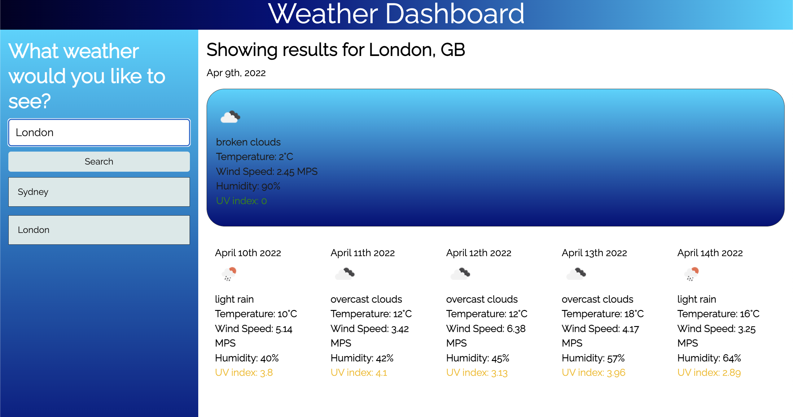

# Weather Planner for the week!

## Overview:

 

To view the code click here
[click here](https://github.com/Key16/Unit-6-Assignment-Weather-Forecast).

To view the website live
[click here](https://key16.github.io/Unit-6-Assignment-Weather-Forecast/).

## Description:

The weather dashboard shows a search for the city name, and will return the city and country it is referencing, then present the weather in a dashboard. The results show current weather, and then the forecast for the next 5 days, including the date, wind speed, humidity, temperature and UV index that will change colour depending on the severity.

There were 3 main components. Interacting with the [Open Weathe API](https://openweathermap.org/api/) to pull live weather, showing these dynamically using JS, and accessing historical search.

### Open Weather API 
2 APIs were used to get the long and lat of the city searched. This is then passed into another call to get the weather details of that city. It also uses Moment JS library to dynamically change the date for the future dates.

### Using  JS to embed elements into HTML

The first div shows current weather, and the second div below shows the future forecast for the next 5 days. It is in a flex box to show vertically on mobile. 

### Historical searches

When a city is searched, the history is updated to see what was historically searched. If clicked, the search will automatically apply. So far it only as the last saved searched.

### Future plans 

Have an option to pick which country if there are multiple cities
Include more than one option in the local storage.